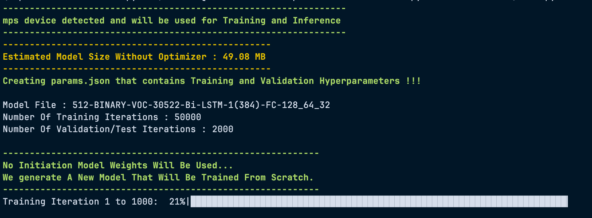

# NLP with Transformers

This project provides a framework for training and evaluating text classification models using a custom Transformer-based neural network. The implementation is built with PyTorch and allows for flexible configuration and experimentation.

## Project Overview

The core of this project is a from-scratch implementation of a Transformer-based text classifier. It's designed to be a flexible tool for understanding and applying Transformer architectures to NLP tasks.


## Getting Started

### Prerequisites

*   Python 3.10+
*   Poetry for dependency management

### Installation

1.  Clone the repository:
    ```bash
    git clone https://github.com/kelevra1993/nlp-with-transformers.git
    ```
2.  Install the dependencies using Poetry:
    ```bash
    poetry install
    ```

### Configuration

Before you can train a model, you need to create a configuration file. An example configuration is provided in `config/sequence_classifier_project_config.example.yml`.

1.  **Copy the example configuration:**
    ```bash
    cp config/sequence_classifier_project_config.example.yml config/my_config.yml
    ```
2.  **Edit the configuration file (`config/my_config.yml`)** to specify the paths to your data and set the desired hyperparameters.

    **Important:** The `train_csv_file`, `valid_csv_file`, and `test_csv_file` parameters should point to the `training_dataframe.csv`, `validation_dataframe.csv`, and `test_dataframe.csv` files located in the `data` directory to try out the repository.

### Training

Once you have configured your project, you can start the training process by running the `main.py` script:

```bash
python transformers/main.py
```

The training script will:

1.  Load the configuration file.
2.  Initialize the model, tokenizer, and optimizer.
3.  Load the training, validation, and test datasets.
4.  Start the training loop, saving model checkpoints and results at regular intervals.

During training, you will see a progress bar and logging information in the console, similar to this:



### Data Storage

The training process will create a new directory in the project's root folder. The name of this directory is generated based on the model's architecture and hyperparameters. This directory will contain:

*   **`Results/`**: This directory will contain the evaluation results for each model checkpoint.
*   **`Weights/`**: This directory will contain the saved model weights for each checkpoint.
*   **`params.json`**: This file contains a copy of the configuration used for the training run.

## Repository Structure

```
├── config/
│   └── sequence_classifier_project_config.example.yml  # Example configuration file
├── data/
│   ├── small_training_dataframe.csv
│   ├── test_dataframe.csv
│   ├── training_dataframe.csv
│   └── validation_dataframe.csv
├── readme/
│   └── training_progress.png
├── transformers/
│   ├── main.py                                         # Main entry point for training
│   ├── models/
│   │   └── model.py                                    # Transformer model implementation
│   └── trainer/
│       └── sequence_classifer_trainer.py               # Trainer class
└── ...
```
